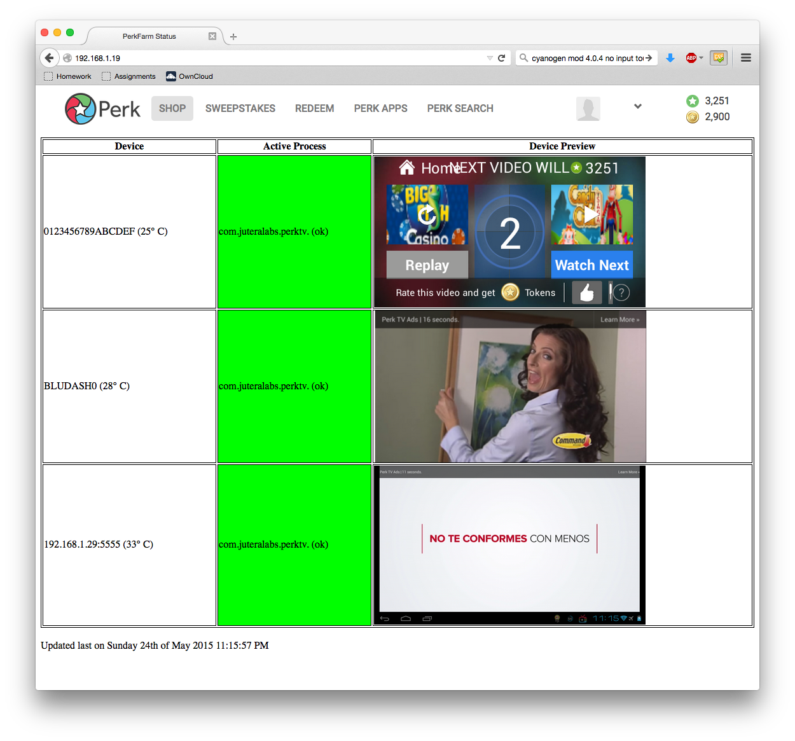

# PerkFarm: PerkTV Bulk Remote Monitoring

This is an old, terrible, and insecure web app which enables browser control of USB connected Android devices. I primarily used this to monitor my array of phones I used for PerkTV (while it was still profitable). This site allows limited touch and keyboard input on all connected devices while providing a live preview of the device's screen. 

### Requirements:
1. Some sort of secured gateway which heavily limits access to this site. This is a requirement if you plan to make this accessible over the internet because not only are you putting control of these devices on the internet, this web app also has quite a few shell injection vulnerabilities on whatever server is hosting it.
2. A modern version of `adb`. Older variants don't support certain features.
3. A web server of sorts with PHP support

Again, I'd like to reiterate that this is not a "product" but instead something I whipped up in a day a few years ago to solve a problem. Use it at your own peril.  